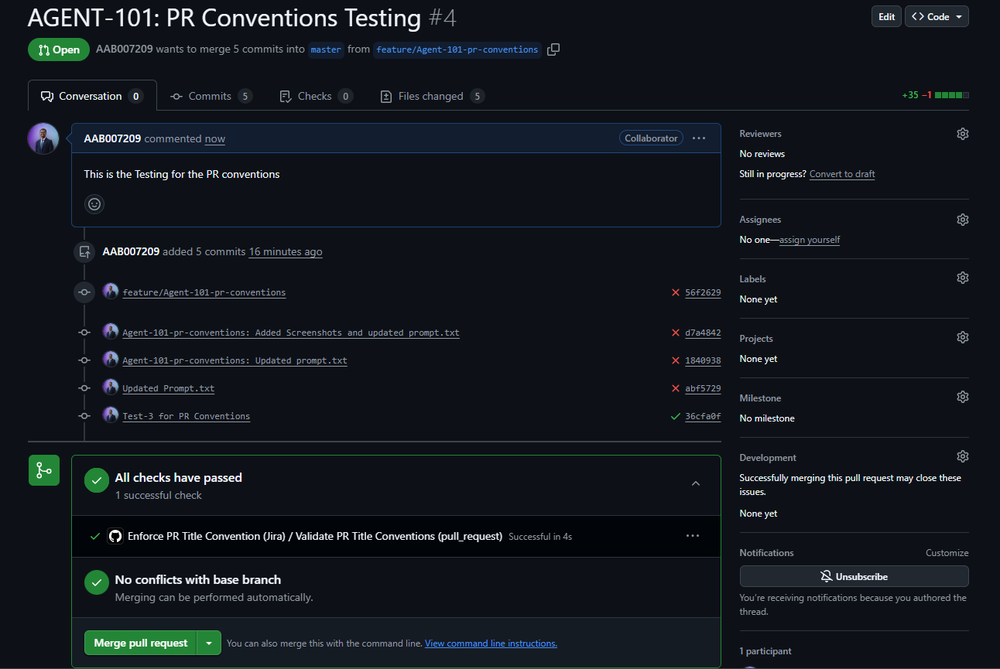
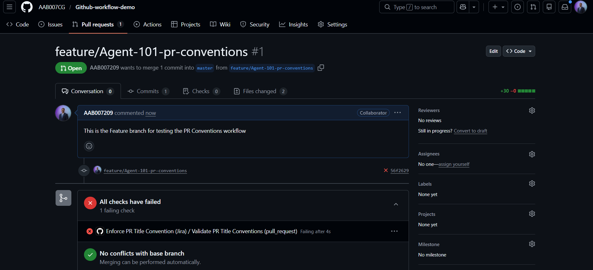

# Github-Workflow-Integration-demo
This is the Repo to test the PR_Conventions and Sonarcloud analysis when integrated with the Github Actions.

### 1. UseCase: PR-Conventions Workflow

This branch includes all the details related to the PR-Conventions Workflow.

### github_integration_demo.yml

This file is written to enforce the PR title conventions for the team. For example in this case the teams are required to follow the below instructions while raising the PR in the title section:

The PR title must:

1. Start with `ALL CAPS` letters (2–10 chars)
2. Followed by `-`
3. Followed by `Numbers`
4. Followed by a colon `:`

Examples: 

Accepted: 
AGENT-101: Pushing the latest change ✅

Denied: Agent-101-pr-conventions: latest changes ❌

If all the above conditions are satisfied the Pull request will have no issues for the merging before another teammate comes to review it.

Below are few screenshots of failure and success PR-title:

### PR Title Convention – Success ✅

---

### PR Title Convention – Failure ❌

